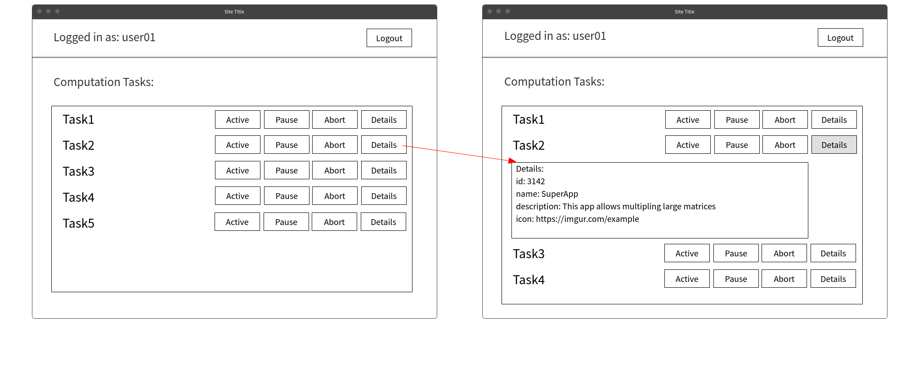

## Scenariusz do przypadku użycia UC10:  Show CT Details
SP: App User znajduje się w CC
### Scenariusz główny
1. App User wybiera opcję "Details" przy wybranym CT <<*trigger*>>
2. System pobiera szczegóły wybranego CT <<*data*>>
3. System wyświetla szczegóły wybranego CT<<*screen*>>

