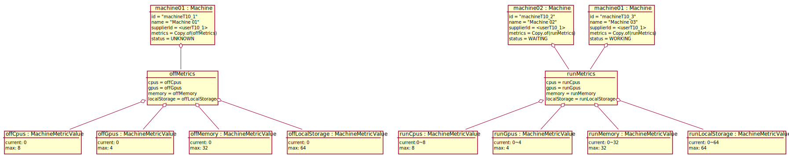

# Test Scenario

## T10 Show Owned CN Details

### Dane początkowe



### Warunki początkowe

- Zalogowany użytkownik to `userT10_1`.
- Początkowy widok to "Owned mashine list".

### Przypadki testowe

#### 1. Wyświetlenie detali zadeklarowanej maszyny.

1. __Supplier__ klika przycisk "Details" przy maszynie "Machine 01".
2. System wyświetla widok detali maszyny zawierający infomacje:
    ```json
    {
      "name": "Machine 01",
      "metrics": {
        "cpus": {
          "current": 0,
          "max": 8
        },
        "gpus": { 
          "current": 0,
          "max": 4
        },
        "memory": {
          "current": 0,
          "max": 32
        },
        "localStorage": {
          "current": 0,
          "max": 64
        }
      },
      "status": "UNKNOWN"
    }
    ```
3. __Supplier__ naciska na przysik "Show token"
4. System wyświetla token.
   

___WARUNKI SUKCESU:___

- Wyświetliły się zadeklarowane parametry maszyny.
- Token wyświetlił się dopiero po naciśnięciu na przycisk.

#### 2. Wyświetlenie detali zaakceptiowanej maszyny.

1. __Supplier__ klika przycisk "Details" przy maszynie "Machine 02".
2. System wyświetla widok detali maszyny zawierający:
    ```json
    {
      "name": "Machine 02",
      "metrics": {
        "cpus": {
          "current": 0~8,
          "max": 8
        },
        "gpus": { 
          "current": 0~4,
          "max": 4
        },
        "memory": {
          "current": 0~32,
          "max": 32
        },
        "localStorage": {
          "current": 0~64,
          "max": 64
        }
      },
      "status": "WAITING"
    }
    ```
    

___WARUNKI SUKCESU:___

- Wyświetliły się zadeklarowane parametry maszyny.
- Wyświetlił się status maszyny.

#### 3. Wyświetlenie detali uruchomionej maszyny.

1. __Supplier__ klika przycisk "Details" przy maszynie "Machine 03".
2. System wyświetla widok detali maszyny zawierający:
    ```json
    {
      "name": "Machine 03",
      "metrics": {
        "cpus": {
          "current": 0~8,
          "max": 8
        },
        "gpus": { 
          "current": 0~4,
          "max": 4
        },
        "memory": {
          "current": 0~32,
          "max": 32
        },
        "localStorage": {
          "current": 0~64,
          "max": 64
        }
      },
      "status": "WORKING"
    }
    ```
    

___WARUNKI SUKCESU:___

- Wyświetliły się zadeklarowane parametry maszyny.
- Wyświetlił się status maszyny.