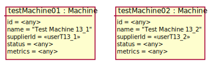

# Test Scenario

## UC13 Show all CN list

### Dane początkowe



### Przypadki testowe

__WARUNKI POCZĄTKOWE:__ 

- Zalogowany __Administrator__ to __adminT13_1__.

#### 1. Pomyślne wyświetlenie listy wszystkich maszyn.

1. __adminT13_1__ wybiera opcję wyświetlenia CN
2. System wyświetla tabelę posiadanych CN - pokazując ich nazwy, statusy oraz właścicieli
    ```json
    [{
       "Machine name": "Test Machine 13_1",
       "Status": <any>,
       "Owner": <<userT13_1>>
    }, {
       "Machine name": "Test Machine 13_2",
       "Status": "Disabled",
       "Owner": <<userT13_2>>
    }]
    ```

___WARUNEK SUKCESU:___

- Data wyświetlają się poprawnie w tabeli.