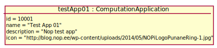
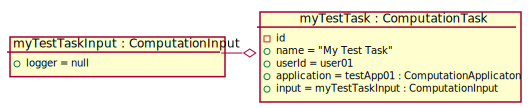
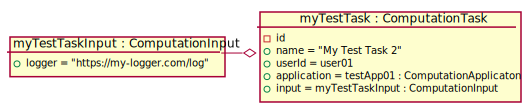

# Test Scenario

## T1 Stworzenie nowego CT

### Sprawdzane UC

- [UC6](../scenarios/UC6_Create%20CT)

### Dane początkowe



### Warunki początkowe 

- Zalogowany __App User__ to _user01_.
- Początkowy widok to szczegóły aplikacji "Test App 01".

### Przypadki testowe

#### 1. Stworzenie nowego CT

1. __App User__ wybiera opcję "Create CT"
2. System wyświetla formularz tworzenia CT
3. __App User__ wypełnia formularz tworzenia CT
    ```
    name = My Test Task
    logger = default
    ```
4. __App User__ wybiera opcję "Create"
5. System wyświetla informację o poprawnie utworzonym CT o nazwie "My Test Task"
6. __App User__ wybiera opcję "OK"

___WARUNKI SUKCESU:___

- W bazie został utworzony nowy ComputationTask.

    

#### 2. Stworzenie nowego CT z własnym loggerem.

1. __App User__ wybiera opcję "Create CT"
2. System wyświetla formularz tworzenia CT
3. __App User__ wypełnia formularz tworzenia CT
    ```
    name = My Test Task 2
    logger = https://my-logger.com/log
    ```
4. __App User__ wybiera opcję "Create"
5. System wyświetla informację o poprawnie utworzonym CT o nazwie "My Test Task 2"
6. __App User__ wybiera opcję "OK"

___WARUNKI SUKCESU:___

- W bazie został utworzony nowy ComputationTask.

    
    
#### 3. Stworzenie nowego CT z własnym, ale niepoprawnym loggerem.

1. __App User__ wybiera opcję "Create CT"
2. System wyświetla formularz tworzenia CT
3. __App User__ wypełnia formularz tworzenia CT
    ```
    name = My Test Task 3
    logger = "definitely not html string"
    ```
4. __App User__ wybiera opcję "Create"
5. System wyświetla informację o niepoprawnym formacie loggera i wymogu formatu url-a.
6. __App User__ wybiera opcję "OK"

___WARUNKI SUKCESU:___

- W bazie nie został utworzony żaden nowy ComputationTask.
