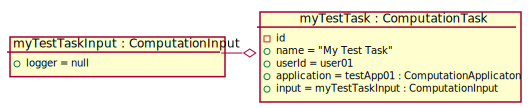

# Test Scenario

## T1 Stworzenie nowego CT

### Sprawdzane UC

- [UC6](../scenarios/UC6_Create%20CT)

### Dane początkowe


### Warunki początkowe 

- Zalogowany __App User__ to _user01_.

### Przypadki testowe

#### 1. Stworzenie nowego CT

1. __App User__ wybiera przycisk "Add Computation Task"
2. System wyświetla listę aplikacji zawierającą przynajmniej "Test App 01"
3. __App User__ kilka przycisk "Choose" przy applikation "Test App 01"
4. System wyświetla szczegóły aplikacji
5. __App User__ wybiera opcję "Create CT"
6. System wyświetla formularz tworzenia CT
7. __App User__ wypełnia formularz tworzenia CT
    ```
    name = My Test Task
    logger = default
    ```
8. __App User__ wybiera opcję "Create"
9. System wyświetla informację o poprawnie utworzonym CT
10. __App User__ wybiera opcję "OK"

### Warunki sukcesu

- W bazie został utworzony nowy ComputationTask.

    