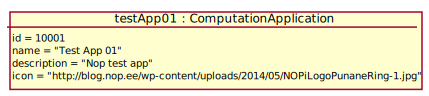

# Test Scenario

## T1 Stworzenie nowego CT

### Sprawdzane UC

- [UC6](../scenarios/UC6_Create%20CT)

### Dane początkowe



### Warunki początkowe 

- Zalogowany __App User__ to _user01_.
- Początkowy widok to lista aplikacji.

### Przypadki testowe

#### 1. Stworzenie nowego CT

1. __App User__ kilka przycisk "Show" przy applikation "Test App 01"
2. System wyświetla szczegóły aplikacji
3. __App User__ wybiera opcję "Create CT"
4. System wyświetla formularz tworzenia CT
5. __App User__ wypełnia formularz tworzenia CT
    ```
    name = My Test Task
    logger = default
    ```
6. __App User__ wybiera opcję "Create"
7. System wyświetla informację o poprawnie utworzonym CT o nazwie "My Test Task"
8. __App User__ wybiera opcję "OK"

### Warunki sukcesu

- W bazie został utworzony nowy ComputationTask.

    