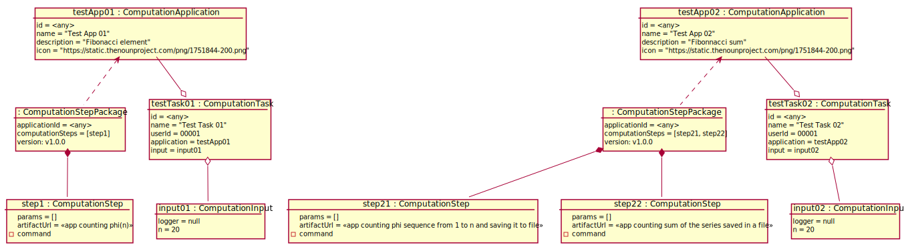

# Test Scenario

## T4 Aktywowanie CT

### Sprawdzane UC

- [UC4](../scenarios/UC4_Activate%20Computation%20Task)

### Dane początkowe



### Warunki początkowe 

- Zalogowany __App User__ to _user01_.

### Przypadki testowe

#### 1. Uruchomienie tasku z niepoprawnym loggerem.

1. __App User__ wybiera opcję wyświetlenia zdefiniowanych CT
2. System wyświetla listę nazw zdefiniowanych CT 
    ```
    - "Test Task 01"
    - "Test Task 02"
    ```
3. __App User__ wybiera opcję "Activate" przy "Test Task 02". 
4. System wyświetla dane wejściowe CT.
    ```
    logger = "https://non-existing-logger.com"
    ```
5. __App User__ wybiera opcję "OK"
6. System wyświetla ostrzeżenie o niemożliwości skomunikowania się 
   z loggerem `https://non-existing-logger.com`.
7. __App User__ wybiera opcję "OK"

___WARUNEK SUKCESU:___

- Żaden ComputationTask nie został uruchomiony.

#### 2. Uruchomienie poprawnego tasku

1. __App User__ wybiera opcję wyświetlenia zdefiniowanych CT
2. System wyświetla listę nazw zdefiniowanych CT 
    ```
    - "Test Task 01"
    - "Test Task 02"
    ```
3. __App User__ wybiera opcję "Activate" przy "Test Task 01". 
4. System wyświetla dane wejściowe CT.
    ```
    logger = default
    ```
5. __App User__ wybiera opcję "OK"
6. System wyświetla informację o poprawnym uruchomieniu CT "Test Task 01".
7. __App User__ wybiera opcję "OK"
8. __System__ wyświetla widok CT "Test Task 01" ze statusem "IN_PROGRESS"
9. __App User__ wybiera opcję "Odśwież logi" po około 10 sekundach
10. __System__ wyświetla log z aktualną godziną i treścią "OK"
11. System wyświetla status "DONE"

___WARUNEK SUKCESU:___

- Do domyślnego loggera zostało wypisane "OK".

#### 3. Anulowanie uruchomionego taska

1. __App User__ wybiera opcję wyświetlenia zdefiniowanych CT
2. System wyświetla listę nazw zdefiniowanych CT 
    ```
    - "Test Task 01"
    - "Test Task 02"
    ```
3. __App User__ wybiera opcję "Activate" przy "Test Task 01". 
4. System wyświetla dane wejściowe CT.
    ```
    logger = default
    ```
5. __App User__ wybiera opcję "OK"
6. System wyświetla informację o poprawnym uruchomieniu CT "Test Task 01".
7. __App User__ wybiera opcję "OK"
8. System wyświetla widok CT "Test Task 01" ze statusem "IN_PROGRESS"
9. __App User__ wybiera opcję "Anuluj"
10. System wyświetla informację o poprawnym anulowaniu CT "Test Task 01".
11. __App User__ wybiera opcję "OK"
12. __App User__ wybiera opcję "Odśwież logi" po około 10 sekundach
13. System wyświetla status "CANCELED"

___WARUNEK SUKCESU:___

- Do domyślnego loggera nie zostały zalogowane nowe logi
- Status CT zmienił się na "CANCELED"
