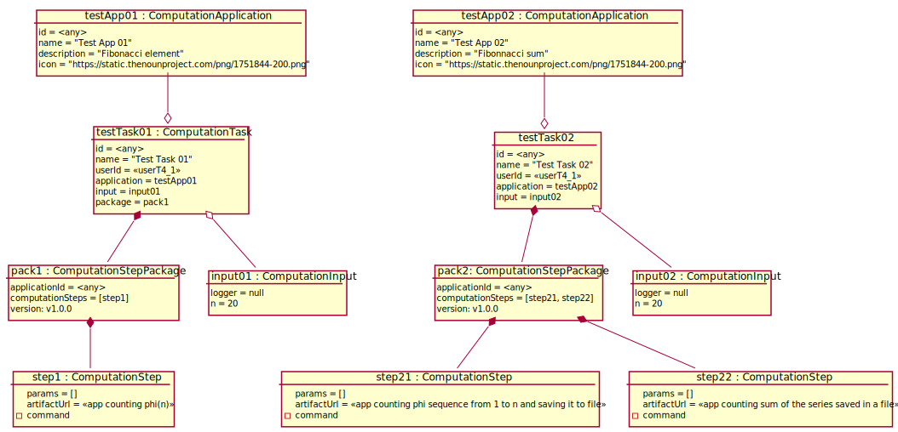

# Test Scenario

## T4 Aktywowanie CT

### Sprawdzane UC

- [UC4](../scenarios/UC4_Activate%20Computation%20Task)

### Dane początkowe



### Warunki początkowe 

- Zalogowany __App User__ to _userT4_1_.

### Przypadki testowe

#### 1. Uruchomienie jednoetapowego tasku

1. __App User__ wybiera opcję wyświetlenia zdefiniowanych CT.
2. _Launcher_ wyświetla listę nazw zdefiniowanych CT.
    ```
    - "Test Task 01"
    ```
3. __App User__ wybiera opcję "Activate" przy "Test Task 01". 
4. _Launcher_ wyświetla dane wejściowe CT.
    ```
    logger = default
    n = 20
    ```
5. __App User__ wybiera opcję "OK"
6. _Launcher_ wyświetla informację o poprawnym uruchomieniu CT "Test Task 01".
7. __App User__ wybiera opcję "OK"
8. _Launcher_ wyświetla widok CT "Test Task 01" ze statusem "IN_PROGRESS"
9. __App User__ wybiera opcję "Refresh logs" po około 60 sekundach
10. _Launcher_ wyświetla log z aktualną godziną. 

___WARUNEK SUKCESU:___

- AD8. _Launcher_ wyświetla status "IN PROGRESS" przy "Test Task 01".
- AD10. _Launcher_ wyświetla logi z wynik = `6765` przy "Test Task 01"
- AD10. _Launcher_ wyświetla status "DONE" przy "Test Task 01".

#### 2. Uruchomienie dwuetapowego tasku

1. __App User__ wybiera opcję wyświetlenia zdefiniowanych CT.
2. _Launcher_ wyświetla listę nazw zdefiniowanych CT.
    ```
    - "Test Task 02"
    ```
3. __App User__ wybiera opcję "Activate" przy "Test Task 02". 
4. _Launcher_ wyświetla dane wejściowe CT.
    ```
    logger = default
    n = 20
    ```
5. __App User__ wybiera opcję "OK"
6. _Launcher_ wyświetla informację o poprawnym uruchomieniu CT "Test Task 02".
7. __App User__ wybiera opcję "OK"
8. _Launcher_ wyświetla widok CT "Test Task 02" ze statusem "IN_PROGRESS"
9. __App User__ wybiera opcję "Refresh logs" po około 60 sekundach
10. _Launcher_ wyświetla log z aktualną godziną. 
11. __App User__ wybiera opcję "Refresh logs" po około 60 sekundach
12. _Launcher_ wyświetla log z aktualną godziną. 

___WARUNEK SUKCESU:___

- AD10. _Launcher_ wyświetla 2 logach przy "Test Task 02" wyniki pośrednie, ale nie końcowe:

    ``` 1
        1
        2
        3
        5
        8
        13
        21
        34
        55
        89
        144
        233
        377
        610
        987
        1597
        2584
        4181
        6765
    ```

- AD10. _Launcher_ wyświetla status "IN PROGRESS" przy "Test Task 02".
- AD12. _Launcher_ wyświetla w logach wynik = `17710` przy "Test Task 02".
- AD12. _Launcher_ wyświetla status "DONE" przy "Test Task 02".