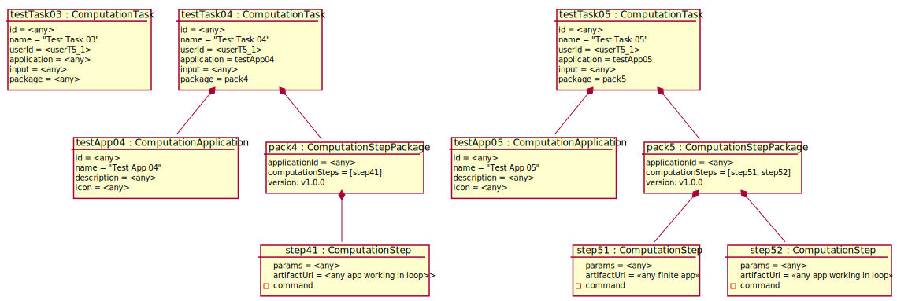

# Test Scenario

## T5 Anulowanie CT

### Sprawdzane UC

- [UC3](../scenarios/UC3_Abort%20CT)

### Dane początkowe



### Warunki początkowe 

- Zalogowany __App User__ to _user01_.

### Przypadki testowe

#### 1. Przerwana próba anulowania zapętlonego tasku.

1. __App User__ wybiera opcję wyświetlenia zdefiniowanych CT
2. System wyświetla listę nazw zdefiniowanych CT 
    ```
    - "Test Task 03"
    - "Test Task 04"
    ```
3. __App User__ wybiera opcję "Abort" przy "Test Task 04". 
4. System wyświetla okno potwierdzenia, z pytaniem 
   "Are you sure, you want to abort "Test Task 04"?"
5. __App User__ wybiera opcję "NO"
6. System zamyka okno potwierdzenia.

___WARUNEK SUKCESU:___

- Żaden Computation nie został przerwany.

#### 2. Anulowanie nieuruchomionego tasku.

1. __App User__ wybiera opcję wyświetlenia zdefiniowanych CT
2. System wyświetla listę nazw zdefiniowanych CT 
    - `"Test Task 03"`
    - `"Test Task 04"`
3. __App User__ wybiera opcję "Abort" przy "Test Task 03". 
4. System wyświetla okno potwierdzenia, z pytaniem 
   "Are you sure, you want to abort "Test Task 03"?"
5. __App User__ wybiera opcję "YES"
6. System wyświetla informację "Test Task 03 hasn't been activated".
7. __App User__ wybiera opcję "OK"

___WARUNEK SUKCESU:___

- Żaden Computation nie został przerwany.

#### 3. Anulowanie zapętlonego tasku.

1. __App User__ wybiera opcję wyświetlenia zdefiniowanych CT
2. System wyświetla listę nazw zdefiniowanych CT 
    - `"Test Task 03"`
    - `"Test Task 04"`
3. __App User__ wybiera opcję "Abort" przy "Test Task 04". 
4. System wyświetla okno potwierdzenia, z pytaniem 
   "Are you sure, you want to abort "Test Task 04"?"
5. __App User__ wybiera opcję "YES"
6. System wyświetla informację o poprawnym anulowaniu "Test Task 04".
7. __App User__ wybiera opcję "OK"

___WARUNEK SUKCESU:___

- directRunning zostaje usunięte
- Działająca aplikacja na maszynie sprzężona z directRunning zostaje zatrzymana
