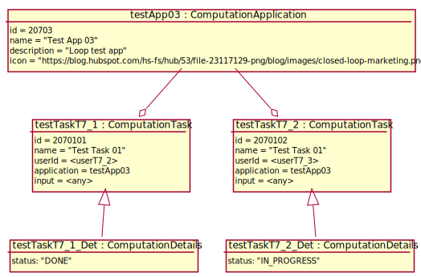

# Test Scenario

## T7 Show Computation Cockpit

### Dane początkowe



### Warunki Początkowe

- Strona startowa to strona logowania.

### Przypadki testowe

#### 1. Otwarcie kokpitu bez zapamiętanych tasków

___WARUNKI POCZĄTKOWE:___

1. __App User__ wprowadza dane logowania:
    ```
        userT7_1 / pass
    ```
2. System wyświetla kokpit zawierający następujące komponenty:
    - Własne, zapisane Aplikacje wraz z przyciskami "Create new Task":
      ```json
      { 
        "testApp03": {
          "name": "Test App 03",
          "icon": "Loop test app",
          "description": "https://blog.hubspot.com/hs-fs/hub/53/file-23117129-png/blog/images/closed-loop-marketing.png"
        }
      }
      ```

___WARUNEK SUKCESU:___

- Został wyświetlony Application Shelf.
- Nie zostały wyświetlony żadne taski.

#### 2. Otwarcie kokpitu ze zdefiniowanymi taskami

1. __App User__ wprowadza dane logowania:
    ```
        userT7_2 / pass
    ```
2. System wyświetla kokpit zawierający następujące komponenty:
    - Własne, zapisane Aplikacje wraz z przyciskami "Create new Task":
      ```json
       { 
         "testApp03": {
           "name": "Test App 03",
           "icon": "Loop test app",
           "description": "https://blog.hubspot.com/hs-fs/hub/53/file-23117129-png/blog/images/closed-loop-marketing.png"
         }
       }
       ```
    - Własne CT wraz z widoczną nazwą i statusami:
      ```json
      { 
        "testTaskT7_1": {
          "name": "Test Task T7_1",
          "status": "DONE"
        }  
      }
      ```

___WARUNEK SUKCESU:___

- Został wyświetlony Application Shelf.
- Został wyświetlony CT o statusie "DONE"

#### 3. Otwarcie kokpitu z uruchomionymi taskami

1. __App User__ wprowadza dane logowania:
    ```
        userT7_3 / pass
    ```
2. System wyświetla kokpit zawierający następujące komponenty:
    - Własne, zapisane Aplikacje wraz z przyciskami "Create new Task":
      ```json
       { 
         "testApp03": {
           "name": "Test App 03",
           "icon": "Loop test app",
           "description": "https://blog.hubspot.com/hs-fs/hub/53/file-23117129-png/blog/images/closed-loop-marketing.png"
         }
       }
       ```
    - Własne CT wraz z widoczna nazwą i statusami:
      ```json
      { 
        "testTaskT7_2": {
          "name": "Test Task T7_2",
          "status": "IN PROGRESS"
        }  
      }
      ```

___WARUNEK SUKCESU:___

- Został wyświetlony Application Shelf.
- Został wyświetlony CT o statusie "IN PROGRESS"