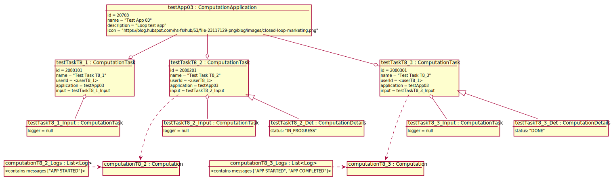

# Test Scenario

## T8 Show Computation Task Details

### Dane początkowe



### Przypadki testowe

#### 1. Otwarcie nieuruchomionego computation taska

___WARUNKI POCZĄTKOWE:___

- Zalogowany użytkownik to "userT8_1".

1. __App User__ wybiera "Show details" przy "Test Task T8_1".
2. System wyświetla:
    - konfigurację CT
      ```json
      {
        "logger": "null|default"
      }
      ```
    - aktualny status: ""
    

___WARUNKI SUKCESU:___

- Pojawia się konfiguaracja CT.
- Nie zostają wyświetlone aktualne logi.
- Nie pojawia się żaden status.

#### 2. Otwarcie uruchomionego zloopowanego computation taska

___WARUNKI POCZĄTKOWE:___

- Zalogowany użytkownik to "userT8_1".

1. __App User__ wybiera "Show details" przy "Test Task T8_2".
2. System wyświetla:
    - konfigurację CT
      ```json
      {
        "logger": "null|default"
      }
      ```
    - aktualny status: "IN PROGRESS"
    - aktualne logi:
        ```
        <anything>
        APP STARTED
        ```

___WARUNKI SUKCESU:___

- Pojawia się konfiguracja CT.
- Pojawiają się aktualne logi.
- Pojawia się status "IN PROGRESS".

#### 3. Otwarcie zakończonego computation taska

- Zalogowany użytkownik to "userT8_1".

1. __App User__ wybiera "Show details" przy "Test Task T8_3".
2. System wyświetla:
    - konfigurację CT
      ```json
      {
        "logger": "null|default"
      }
      ```
    - aktualny status: "DONE"
    - aktualne logi:
        ```
        <anything>
        APP STARTED
        APP COMPLETED
        <anything>
        ```
    

___WARUNKI SUKCESU:___

- Pojawia się konfiguracja CT.
- Pojawiają się logi poprzedniego wykonywania CT.
- Pojawia się status "DONE".