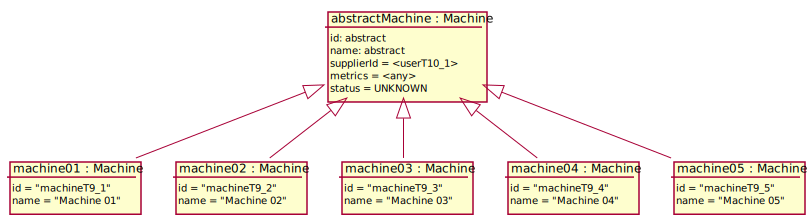

# Test Scenario

## T9 Submit a new CN

### Dane początkowe 

### Przypadki testowe

#### 1. Poprawne zarejestrowanie maszyny

___WARUNKI POCZĄTKOWE:___

- __Supplier__ skonfigurował maszynę do rejestracji.
- __Supplier__ jest zalogowany jako `userT9_1`.
- __Supplier__ znajduje się w detalach maszyny `mashineT9_1`. 

1. __Supplier__ uruchamia na maszynie rejestrację z poprawnie
ustawionym tokenem i parametrami od `mashineT9_1`.
2. System wypisuje w outpucie po pewnym czasie 
informację "Successfully submited".
3. W detalach maszyny `mashineT9_1` __Supplier__ odświeża stronę.  

___WARUNKI SUKCESU:___

- Wyświetlona została informacja "Successfully submited".
- Po odświeżenie, System wyświetlił status "WAITING" maszyny.

#### 2. Próba rejestracji z błędnym tokenem.

___WARUNKI POCZĄTKOWE:___

- __Supplier__ skonfigurował maszynę do rejestracji.
- __Supplier__ jest zalogowany jako `userT9_1`.
- __Supplier__ znajduje się w detalach maszyny `mashineT9_2`. 

1. __Supplier__ uruchamia na maszynie rejestrację z poprawnie
ustawionym tokenem i parametrami od `mashineT9_2`.
2. System wypisuje w outpucie po pewnym czasie 
informację "Unknown".
3. W detalach maszyny `mashineT9_2` __Supplier__ odświeża stronę.  

___WARUNKI SUKCESU:___

- Wyświetlona została informacja "Unknown".
- Po odświeżenie, System wyświetlił status "UNKNOWN" maszyny.

#### 3. Próba rejestracji z tokenem zarejestrowanej już maszyny.

___WARUNKI POCZĄTKOWE:___

- __Supplier__ skonfigurował maszynę do rejestracji.
- __Supplier__ jest zalogowany jako `userT9_1`.
- __Supplier__ znajduje się w detalach maszyny `mashineT9_3`. 

1. __Supplier__ uruchamia na maszynie rejestrację z poprawnie
ustawionym tokenem i parametrami od `mashineT9_4`.
2. System wypisuje w outpucie po pewnym czasie 
informację "Unknown".
3. W detalach maszyny `mashineT9_3` __Supplier__ odświeża stronę.  

___WARUNKI SUKCESU:___

- Wyświetlona została informacja "Unknown".
- Po odświeżenie, System wyświetlił status "UNKNOWN" maszyny.

#### 4. Próba rejestracji z zawyżonymi parametrami.

___WARUNKI POCZĄTKOWE:___

- __Supplier__ skonfigurował maszynę do rejestracji.
- __Supplier__ jest zalogowany jako `userT9_1`.
- __Supplier__ znajduje się w detalach maszyny `mashineT9_5`. 

1. __Supplier__ uruchamia na maszynie rejestrację z poprawnie
ustawionym tokenem i parametrami od `mashineT9_5`.
2. System wypisuje w outpucie po pewnym czasie 
informację "Verification failed".
3. W detalach maszyny `mashineT9_5` __Supplier__ odświeża stronę.  

___WARUNKI SUKCESU:___

- Wyświetlona została informacja "Verification failed".
- Po odświeżenie, System wyświetlił status "UNKNOWN" maszyny.