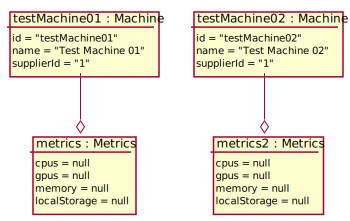

# Test Scenario

## UC8 Show owned CN list

### Sprawdzane UC

- [UC8](../scenarios/UC8_Show%20owned%20CN%20list)

### Dane początkowe



### Przypadki testowe

__WARUNKI POCZĄTKOWE:__ 

- Zalogowany __Supplier__ to _1_.

#### 1. Pomyślne wyświetlenie listy posiadanych maszyn.

1. __user01__ wybiera opcję wyświetlenia posiadanych CN
2. System wyświetla tabelę posiadanych CN - pokazując ich nazwy oraz statusy
    ```json
    [{
       "Machine name": "Test Machine 01",
       "Status": "Disabled"
    }, {
       "Machine name": "Test Machine 02",
       "Status": "Disabled"
    }]
    ```

___WARUNEK SUKCESU:___

- Data wyświetlają się poprawnie w tabeli.

#### 2. Wyświetlenie pustej listy maszyn.

__WARUNKI POCZĄTKOWE:__

- Zalogowany __Supplier__ to _2_.

1. __user02__ wybiera opcję wyświetlenia posiadanych CN
2. System wyświetla pustą tabelę.

___WARUNEK SUKCESU:___

- Wyświetlana tabela nie zawiera danych.