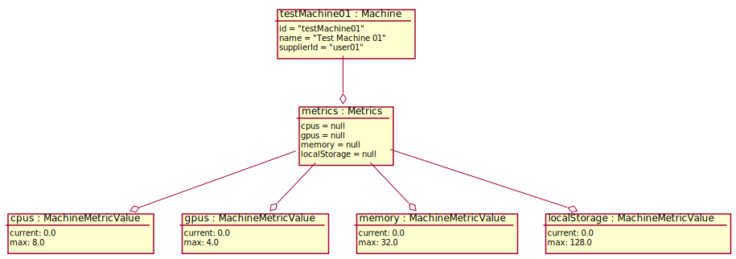

# Test Scenario

## UC9 Signal own status

### Sprawdzane UC

- [UC9](../scenarios/UC9_signal_own_status)

### Dane początkowe



### Warunki początkowe 

- Maszyna jest zarejestrowna w systemie
- Klient działa na maszynie
- Zalogowany __Supplier__ to _user01_.
- Tylko jedna maszyna `Test Machine 01` (właścicielem jest _user01_) jest dostępna

### Przypadki testowe

#### 1. Pomyślne zaraprtowanie statusu

1. __Supplier__ wybiera opcję wyświetlenia posiadanych CN
2. System wyświetla listę posiadanych CN - pokazując ich nazwy oraz statusy
    ```
    - "Test Machine 01 - online"
    ```
3. __Supplier__ wybiera `Test Machine 01`
4. System wyświetla metryki maszyny:
    ```
        CPU: 10%
        GPU: 5%
        Memory: 10%
        Local Storage: 20%
    ```
5. Uruchamiamy aplikację `testApp01` na `testMachine01`
	```
	POST testMachine01/computations
	{
      "computationStep": {
        "params": [],
        "artifactUrl": "http://kcybulski.me/hello.zip",
        "command": "dd if=/dev/zero of=/dev/null"
      }
    }
	```
6. __Supplier__ wybiera `Test Machine 01`
7. System wyświetla metryki maszyny:
   ```
       CPU: 20%
       GPU: 15%
       Memory: 21%
       Local Storage: 20%
   ```

___WARUNEK SUKCESU:___

- Aplikacja wpłynęła na reportowane metryki maszyny